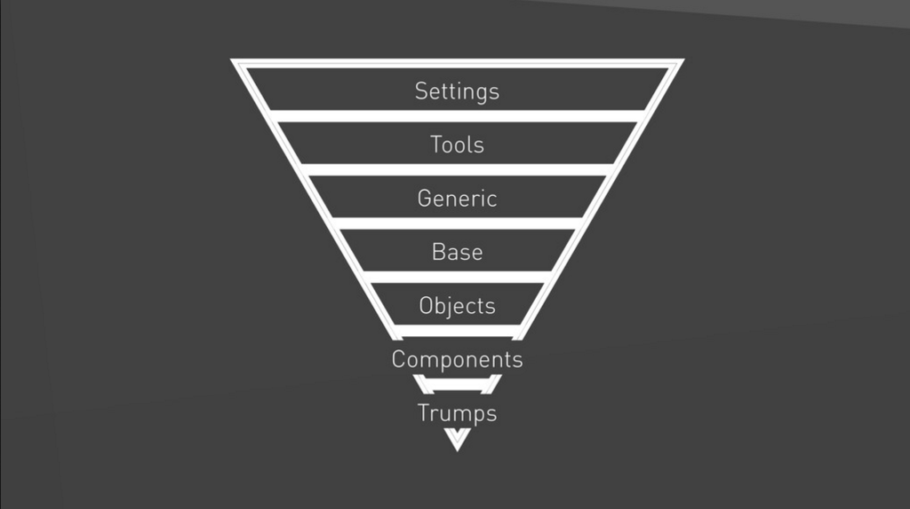
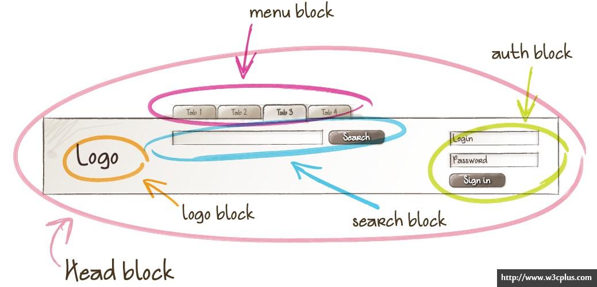
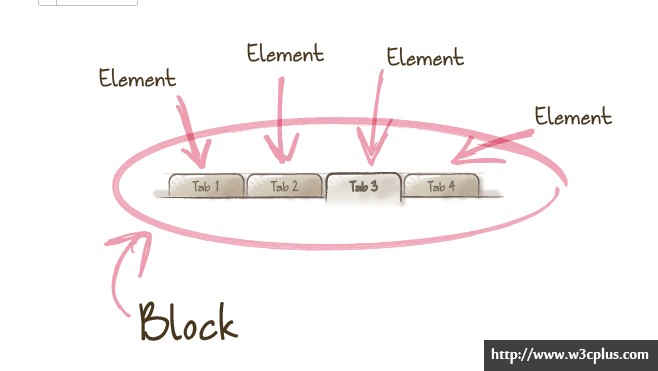
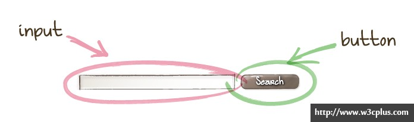
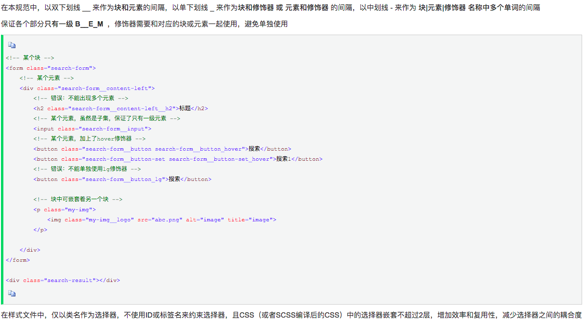
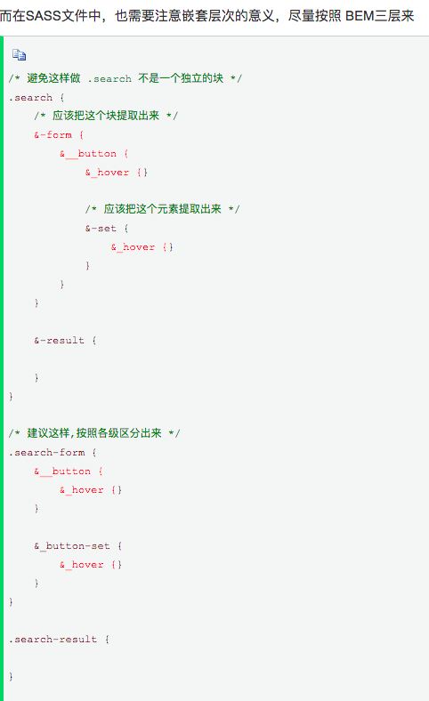
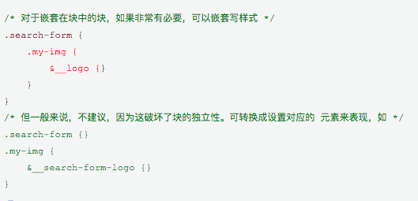
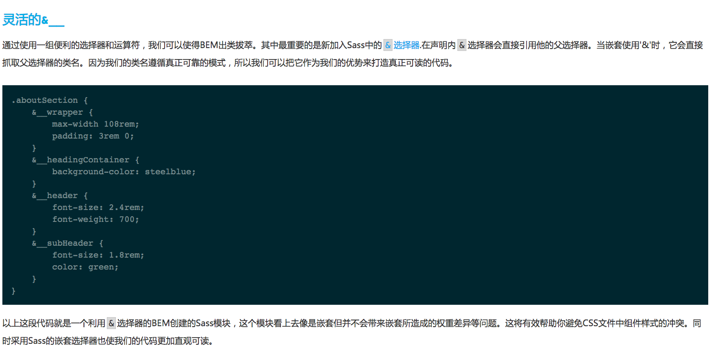

<!--
 * @Author: qianqian.zhao
 * @Date: 2020-03-29 18:49:29
 * @LastEditors: qianqian.zhao
 * @LastEditTime: 2020-04-05 10:31:20
 * @Description: css命名
 -->


### 公共css文件规范
#### css设计使用ITCSS架构
倒三角模型，越往下越具体，越局限于使用在一个具体的画面

1. 设置层：放置全局变量；例：主题色、各个按钮颜色、hover色、基本字体大设置、圆角设置
2. 工具层：放全局使用的工具；例：混入、函数
3. 通用层：重写的element样式放在此文件夹下，属于css重置
4. 元素层：放置更改的元素的样式；例：p元素，div元素，ul元素等
5. 对象层：放全局通用的，又和业务关联的样式；属于页面架构的类，通常会伴随使用OOCSS；例：
注：多个组件内使用到的共同样式，则提取为公共样式放到此文件夹下，命名遵循下方的css命名规范
```javascript
.ul-list {
    margin: 0px;
    .ul-list_item {
        padding: 0px;
    }
}
```
6. 组件层：各个组件内的单独样式，使用scoped限制，命名遵循下方的css命名规范
### css命名规范
css命名采用BEM方法（block-name__element-name--modifier-name)
BEM的意思就是块（block）、元素（element）、修饰符（modifier）
说明：html是一个dom树，写样式就当成一个BEM树；
示例：
```javascript
// html
<ul>
    <li>
        <a>
            <span></span>
        </a>
    </li>
</ul>
// Dom树中有如下四个节点
ul
ul>li
ul>li>a
ul>li>a>span
// 则对应的我们设计如下的BEM命名
<ul class="menu">
    <li class="menu__item">
        <a class="menu__link">
            <span class="menu__text"></span>
        </a>
    </li>
</ul>
```
设计注意点：
* BEM禁止在css的元素中放置css
正确的BEM设计：
```javascript
<div class='block'>
    <div class='block__elem1'>
        <div class='block__elem2'></div>
    </div>
    <div class='block__elem3'></div>
</div>
```
错误的BEM设计：
```javascript
<div class='block'>
    <div class='block__elem1'>
        <div class='block__elem1__elem2'></div>
    </div>
</div>
```
* 没必要真的在每个地方都用上它
当一个元素恰巧出现在一个块内，就没必要使用BEM命名；因为这个元素还可以放置在其它位置；
```javascript
<div class="content">  
  <h1 class="content__headline">Lorem ipsum dolor...</h1>  
</div>
```
在这个例子里，我们也许仅仅只需要另一个class，可以叫它.headline；它的样式取决于它是如何被层叠的，因为它在.content的内部；或者它只是恰巧在.content的内部。如果它是后者（即恰巧在.content的内部，而不总是在）我们就不需要使用BEM
* html元素不能用作css选择器，不依赖元素标签
原则：编写样式时尽量不依赖元素标签，而是直接给标签加上类名，当页面需要重构时，可降低css的维护成本；
例：
```javascript
<nav class="nav--main">   
    <ul>   
        <li><a>.........</a></li>   
        <li><a>.........</a></li>   
        <li><a>.........</a></li>   
    </ul>   
</nav>
```
想要给a标签加样式时，应该直接在a标签上按照BEM方法加上类名
* css选择器的嵌套最多不超过2层，降低与dom树的耦合关系
当页面重构时，css可以最大程度的复用
#### block、element、modifier说明：
参考链接 https://www.w3cplus.com/css/bem-definitions.html
* 块为实体
视觉上的独立部分
页面内的块会嵌套

* 元素也是实体
块内的元素


* 修饰符说明：修饰符是用来描述一个块或者是一个元素实体的属性的
下图中有两个样式有差别的menu菜单，则可以通过修饰符来命名类

### 案例参考
完美结合scss https://www.w3cplus.com/preprocessor/getting-sass-y-with-bem.html




