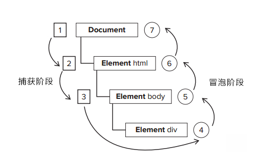

<!--
 * @Author: qianqian.zhao
 * @Date: 2020-04-01 14:11:59
 * @LastEditors: qianqian.zhao
 * @LastEditTime: 2020-04-02 19:46:04
 * @Description: 事件流、事件循环
 -->


## 事件循环
#### 宏事件
1. setTimeout
setTimeout的时间误差
#### 微事件
1. promise

## 事件流
### 事件流的发展历程
**思考**：*如果你点击了一个元素，那么同时你也点击了按钮的包含容器元素；那么必然会出现先执行哪个元素的点击事件的问题；*与此同时，不同的开发团队提出不同的解决方案；

---
* IE的事件流是事件冒泡流
事件冒泡：从事件开始的具体元素，一级级往上传播到较为不具体的节点
* 标准的浏览器事件流是事件捕获流
事件捕获：从根节点开始向目标节点传递，用意在于在事件到达预定目标之前捕获它


**事件流描述的就是节点从页面接收事件的顺序**
* DOM2级事件规定的事件流 ：事件捕获阶段——事件目标阶段——事件冒泡阶段
注：在DOM事件流中，事件的目标在捕获阶段不会接受到事件。但IE9、Safari、Chrome、Firefox和Opera9.5及更高版本都会在捕获阶段触发事件对象上的事件。结果，就是有两个机会在目标对象上操作事件

### 事件处理程序
事件指的是用户或者浏览器自身执行的某种动作，响应这个动作的函数就称为事件处理程序

* DOM0级事件处理程序

将一个函数赋值给一个事件处理程序属性，例如：onclick。为事件处理程序赋值。
```javascript
btn.onclick = function() {
  alert(this.id);		
};
```
事件处理程序在元素的作用域中运行，this指向当前元素
删除事件处理程序：	
```javascript
btn.onclick = null;
```
DOM0级事件都是按照冒泡流进行流转的

* DOM2级事件处理程序

主要的处理事件处理程序的操作有
addEventListener(处理的事件名，事件处理程序函数，布尔值)和removeEventListener(处理的事件名，事件处理程序函数，布尔值)
布尔值：捕获阶段调用事件处理程序：true。冒泡阶段调用：false。大多数情况下用false
btn.addEventListener(eventType, function () {}, false);
该方法应用至dom节点
第一个参数为事件名
第二个为事件处理程序
第三个为布尔值，true为事件捕获阶段调用事件处理程序，false为事件冒泡阶段调用事件处理程序
#### 绑定事件
例子1：
```javascript
<div id="parent">
  <p id="child">
  </p>
</div>
#parent {
  width: 200px;
  height: 200px;
  border: 1px solid red;
}
#child {
  width: 100px;
  height: 100px;
  border: 1px solid blue;
}
var parent = document.getElementById('parent')
var child = document.getElementById('child')
parent.addEventListener('click', function () {
  alert('事件冒泡');
}, false);
parent.addEventListener('click', function () {
  alert('事件捕获');
}, true);

点击div元素，依次弹出结果：事件冒泡－事件捕获
点击p元素，依次弹出结果：事件捕获－事件冒泡
```
```javascript
var parent = document.getElementById('parent')
var child = document.getElementById('child')
parent.addEventListener('click', function () {
  alert('事件捕获');
}, true);
parent.addEventListener('click', function () {
  alert('事件冒泡');
}, false);
点击div元素，依次弹出结果：事件捕获－事件冒泡
点击p元素，依次弹出结果：事件捕获－事件冒泡
```
例子2:
```javascript
var parent = document.getElementById('parent')
var child = document.getElementById('child')
parent.addEventListener('click', function () {
  alert('父级冒泡');
}, false);
parent.addEventListener('click', function () {
  alert('父级捕获');
}, true);
child.addEventListener('click', function () {
  alert('子级冒泡');
}, false);
child.addEventListener('click', function () {
  alert('子级捕获');
}, true);
点击p元素，依次弹出结果：父级捕获－子级冒泡－子级捕获－父级冒泡
```

```javascript
var parent = document.getElementById('parent')
var child = document.getElementById('child')
parent.addEventListener('click', function () {
  alert('父级捕获1');
}, true);
parent.addEventListener('click', function () {
  alert('父级冒泡');
}, false);
child.addEventListener('click', function () {
  alert('子级冒泡');
}, false);
child.addEventListener('click', function () {
  alert('子级捕获');
}, true);
parent.addEventListener('click', function () {
  alert('父级捕获2');
}, true);
```
**结论：**
1. 节点非目标事件的节点时：事件调用顺序会按照DOM2级事件流的顺序，先捕获，后冒泡。如果在一个节点上多次绑定同一个事件的监听，它们会按照事件传播流程进行（先捕获后冒泡），如果所处流程一样则按照先绑定先触发的原则。
2. 当流程到达目标事件节点时：事件调用顺序决定于绑定事件的书写顺序

---
#### 删除事件
删除一个事件处理程序，用removeEventListener
```javascript
var btn=document.getElementById('myBtn');
var myFn=function(){
alert(this.id);
}
btn.addEventListener('click',myFn,false);
btn.removeEventListener('click',myFn,false);
```
如果函数为匿名函数，则没办法移除监听
扩展：在比较新的浏览器中，addEventListener支持更多参数配置，第三个参数类型支持object

### 事件对象及其方法
触发dom上的某个事件时，会产生一个事件对象event，里面包含着所有和事件有关的信息

常用的有：
* currentTarget   事件处理程序当前正在处理事件的节点
* preventDefault  取消事件默认行为,比如链接的跳转
* stopPropagation 取消事件向下一个节点传播，所以如果当前节点如果是目标节点，则只会影响时间冒泡
* target  事件的目标节点
* stopImmediatePropagation 一旦调用这个方法，则该节点上未触发的监听都不会被触发，事件也不会进一步传播(该方法执行后，任何未触发的流转事件都将不再触发)

1. stopPropagation（事件流不会向其他节点传播）
```javascript
var parent = document.getElementById('parent')
var child = document.getElementById('child')
parent.addEventListener('click', function () {
  alert('父级捕获1');
  event.stopPropagation();
}, true);
parent.addEventListener('click', function () {
  alert('父级冒泡');
}, false);
child.addEventListener('click', function () {
  alert('子级冒泡');
}, false);
child.addEventListener('click', function () {
  alert('子级捕获');
}, true);
parent.addEventListener('click', function () {
  alert('父级捕获2');
}, true);
点击p元素（div节点的捕获和冒泡是两个阶段），结果是：父级捕获1－父级捕获2
点击div元素（div节点为目标事件节点），结果是：父级捕获1－父级冒泡－父级捕获2
```
2. stopImmediatePropagation（一旦调用这个方法，则该节点上未触发的监听都不会被触发，事件也不会进一步传播）
```javascript
var parent = document.getElementById('parent')
var child = document.getElementById('child')
parent.addEventListener('click', function () {
  alert('父级捕获1');
  event.stopImmediatePropagation();
}, true);
parent.addEventListener('click', function () {
  alert('父级冒泡');
}, false);
child.addEventListener('click', function () {
  alert('子级冒泡');
}, false);
child.addEventListener('click', function () {
  alert('子级捕获');
}, true);
parent.addEventListener('click', function () {
  alert('父级捕获2');
}, true);
点击p元素，结果是：父级捕获1
点击div元素，结果是：父级捕获1
```
四、事件代理（事件委托）
事件的一些性能和使用的问题：
1. 绑定事件越多，浏览器内存占用越大，严重影响性能。
2. ajax的出现，局部刷新的盛行，导致每次加载完，都要重新绑定事件
3. 部分浏览器移除元素时，绑定的事件并没有被及时移除，导致的内存泄漏，严重影响性能
4. 大部分ajax局部刷新的，只是显示的数据，而操作却是大部分相同的，重复绑定，会导致代码的耦合性过大，严重影响后期的维护。

事件委托利用事件冒泡，只指定一个事件处理程序即可，就可以管理某一个类型的所有事件
```javascript
var parent = document.getElementById('parent')
var child1 = document.getElementById('child1')
var child2 = document.getElementById('child2')
var child3 = document.getElementById('child3')
/* child1.addEventListener('click', function () {
  alert('第一个p元素的事件');
}, false);
child2.addEventListener('click', function () {
  alert('第二个p元素的事件');
}, false);
child3.addEventListener('click', function () {
  alert('第三个p元素的事件');
}, false); */
parent.addEventListener('click', function () {
  alert('父级捕获');
  console.log(event.target)
  if (event.target.id == 'child1') {
    alert('第一个p元素的事件')
  }
}, true);
parent.addEventListener('click', function () {
  alert('父级冒泡');
}, false);
```


参考：
[jianshu](http://jianshu.com)