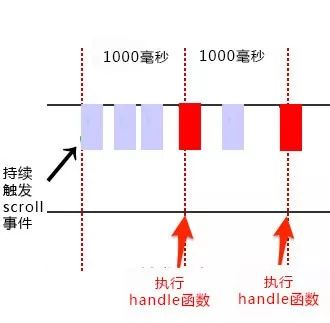

<!--
 * @Author: qianqian.zhao
 * @Date: 2020-03-29 15:51:09
 * @LastEditors: qianqian.zhao
 * @LastEditTime: 2020-04-04 18:31:42
 * @Description: 防抖和节流
 -->


##### 首先我们把对防抖和节流的理解放到一起来看一下

**防抖**：每次事件触发后总是等待一段时间执行，如果在等待时间内事件再次触发，则重新计算等待时间（停止触发的时候只会执行一次,最后一次生效）
**节流**：每次事件触发后总是等待一段时间执行，如果在等待时间内事件再次触发（事件触发时有其他事件在等待），则不作处理。如果事件触发时没有其他事件在等待，则将事件进行绑定（等待时间到则进行事件执行）多次触发事件时只有一次生效，对应时间内只执行一次，第一次生效

我们看一下示意图应该是怎么样的



依据上面的原理以及图示意，我们可以分别将防抖和节流的函数写出来，首先不考虑this指向以及传参，只做一个简单的函数执行
### 防抖函数
#### 函数示意
  ```javascript
  function fun () {
      // 会多次触发的函数
  }
  let timer = null;
  function debounce (fun, wait) {
    // 事件触发，如果之前有等待的事件，则清空计时，重新进行事件等待执行
    if (timer) {
      clearTimeOut(timer);
    }
    timer = setTimeout(fun, wait);
  }
  ```

接下来我们要需要把这个函数封装成为一个公共的方法放在我们的项目中，因为是把函数作为参数传入到防抖函数内，不确定传入的函数内都会使用什么参数，参数绑定的对象是哪个，为了能够准确的使用参数，所以我们在调用时修改this指向
  ```javascript
  let timer = null;
  function debounce (fun,wait) {
    // 事件触发，如果之前有等待的事件，则清空计时，重新进行事件等待执行
    if (timer) {
      clearTimeOut(timer);
    }
    timer = setTimeout(function () {
      fun.apply(this);
    }, wait);
  }
  // 调用
  debounce(fun, 100);
  ```
我们会发现我们向防抖函数传递的参数fun无法传递参数进去，这样就需要进一步的修改了
  #### 防抖传参
  ```javascript
  let timer = null;
  function debounce (fun,wait) {
    return function (...args) {
      // 事件触发，如果之前有等待的事件，则清空计时，重新进行事件等待执行
      if (timer) {
        clearTimeOut(timer);
      }
      timer = setTimeout(function () {
        fun.apply(this, argu);
      }, wait);
    }
  }
  // 调用
  debounce(fun, 100)(argu1, argu2);
  ```

  #### 防抖立即执行
  ```javascript
  let timer = null;
  function debounce (fun, wait, immediate) {
    return (...args) => {
      if (timer) {
        clearTimeOut(timer);
      } else {
        if (immediate) {
          fun(args);
        }
        timer = setTimeout(function () {
          fun.apply(this, argu);
        }, wait);
      }
    }
  }
  ```

### 节流函数

  #### 函数示意

  ```javascript
  let timer = null;
  function throttle (fun,wait) {
    // 事件触发，如果之前有等待的事件，则不作处理
    if (timer) {
    } else {
      事件触发，前面没有事件在等待，则将事件进行等待执行
      timer = setTimeout(function () {
        fun();
      }, wait);
    }
  }
  ```
  同上面的防抖函数一样，只是内部执行时机不同，我们将节流函数进行封装
  ```javascript
  let timer = null;
  function throttle (fun,wait) {
    return function (...args) {
      // 事件触发，如果之前有等待的事件，则不作处理
      if (timer) {
      } else {
        事件触发，前面没有事件在等待，则将事件进行等待执行
        timer = setTimeout(function () {
          fun(args);
          timer = null;
        }, wait);
      }
    }
  }
  // 调用
  throttle(fun, 100)(argu1, argu2);
  ```

  **节流函数有几种写法，我们需要理解的就是这种思想。不管方法封装成什么样，上面的原理理解透彻就可**
  原理：节流函数触发后就进行上锁，时间结束后解锁，后续触发才可执行

#### 使用场景分析
平时开发过程中会有很多的应用场景会使用到
比较常见的就是input框作为搜索条件时的输入，我们会监听input框，如果每次触发都去请求接口就会耗费性能，所以我们应该在用户停止输入后再去请求接口，那就是最后一次时间触发后等待一段时间执行，所以应该使用节流。
还有就是滑动加载页面，用户鼠标向下滑动，一直滑动，则我们需要监听内容区距离底部的距离，当内容区即将展示完毕时，我们就需要请求接口。提取信息就是，比如内容区距离底部100px的过程中我们都会触发事件，但是这个事件会触发很多很多次，所以我们应该第一次监听到就去让事件执行，后续的触发则不再执行

#### 区别
我们的假设都是在延迟的这段时间内发生的事件触发。根据各自的概念就能够知道，防抖是最后一个事件触发后等待一段时间执行。节流是第一个事件触发后到点就触发。

一点点小想法：以防抖来说，如果同时有两个函数先后触发了防抖，则先触发的函数不会被执行，其实是两个不相干的函数，都应该被执行