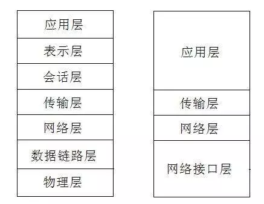

<!--
 * @Author: qianqian.zhao
 * @Date: 2020-03-31 10:00:31
 * @LastEditors: qianqian.zhao
 * @LastEditTime: 2020-04-05 20:56:41
 * @Description: 
 -->

### tcp三次握手
### tcp四次挥手

### tcp/ip协议
基于tcp/ip协议的四层模型：链路层、网络层、传输层、应用层
基于osi协议的七层模型

### DNS解析，也称为域名解析
  浏览器上存有域名和ip地址相互映射的一个数据库；
  通过主机名得到该主机名所对应的ip地址的过程叫做ip地址解析；